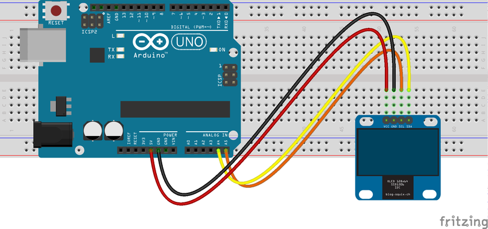

## Description
In this Arduino Project I have created an animation of [Skeletor](https://en.wikipedia.org/wiki/Skeletor) on a 0.96" OLED display using a Genuino/Arduino UNO.

## Hardware Requirements :
1. 0.96" I2C OLED display.
2. Genuino/Arduino Uno 
3. Breadbaord
4. Jumper wires

## Software Requirements : 
1. [Arduino IDE](https://www.arduino.cc/en/Main/Software)
2. [U8g2 Library](https://github.com/olikraus/u8g2)

## Wiring Diagrams : 

